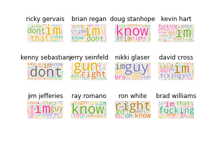
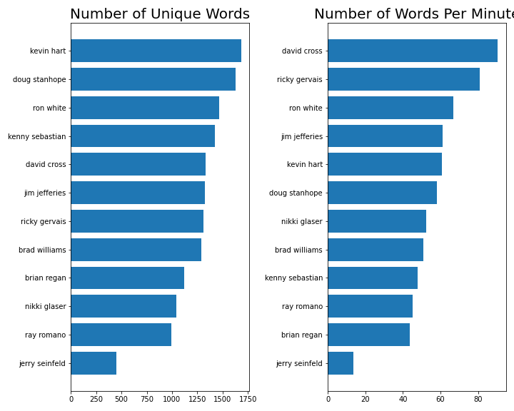
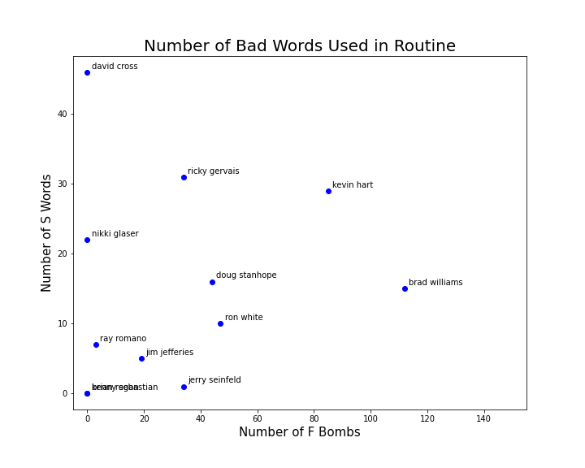
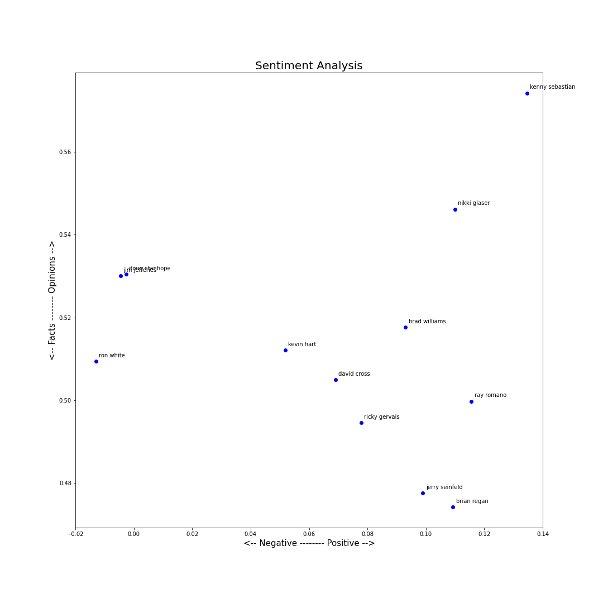
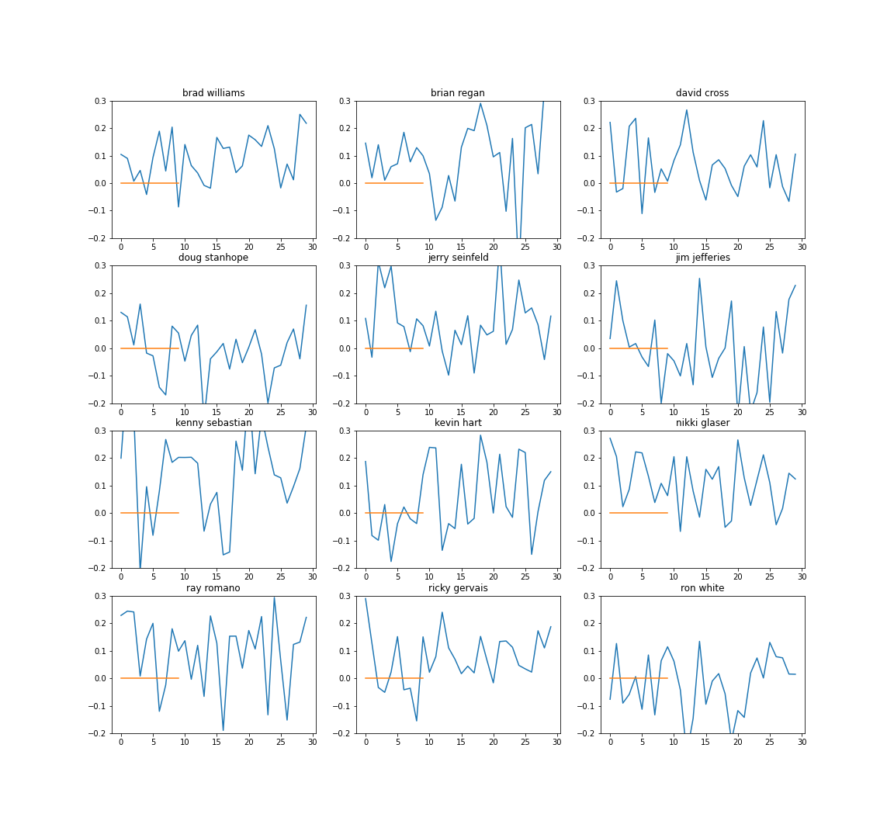

# NLP analysis of comedian scripts

## Comedian list (scraped from [Scraps from the loft](https://scrapsfromtheloft.com/))

1. ricky gervais
2. brian regan
3. doug stanhope
4. kevin hart
5. kenny sebastian
6. jerry seinfeld
7. nikki glaser
8. david cross
9. jim jefferies
10. ray romano
11. ron white
12. brad williams

## Preprocessing scripts

1. Text into lowercase
2. Remove text in square brackets
3. Remove punctuation and remove words containing numbers
4. Remove links

### Wordcloud

### Words analysis

### Profanity

### Sentiment analysis

### Over time

*Note: We can change this interval in the file.*

## Topic Modelling

1. Topic 0: mom, bro
2. Topic 1: profanity
3. Topic 2: relationship status
4. Topic 3: white, black

- Topic 0:
  - david
  - jim
  - kenny
  - ron
- Topic 1:
  - brian
  - kevin
- Topic 2:
  - jerry
- Topic 3:
  - brad
  - doug
  - nikki
  - ray
  - ricky

### Text generation is done in `text_generation.ipynb`
