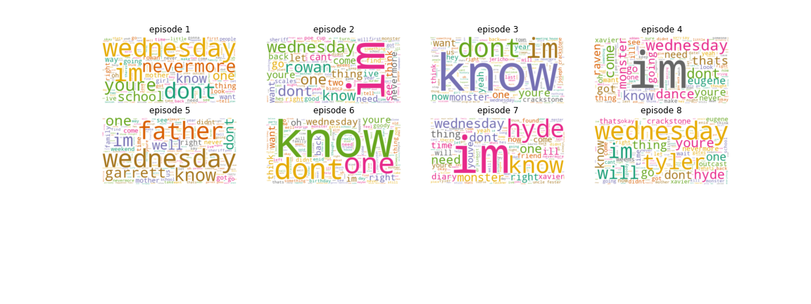
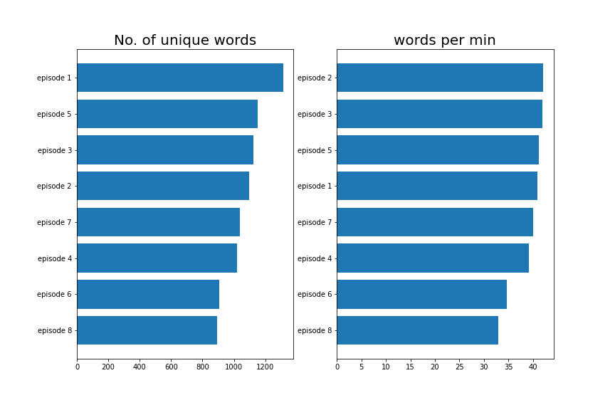
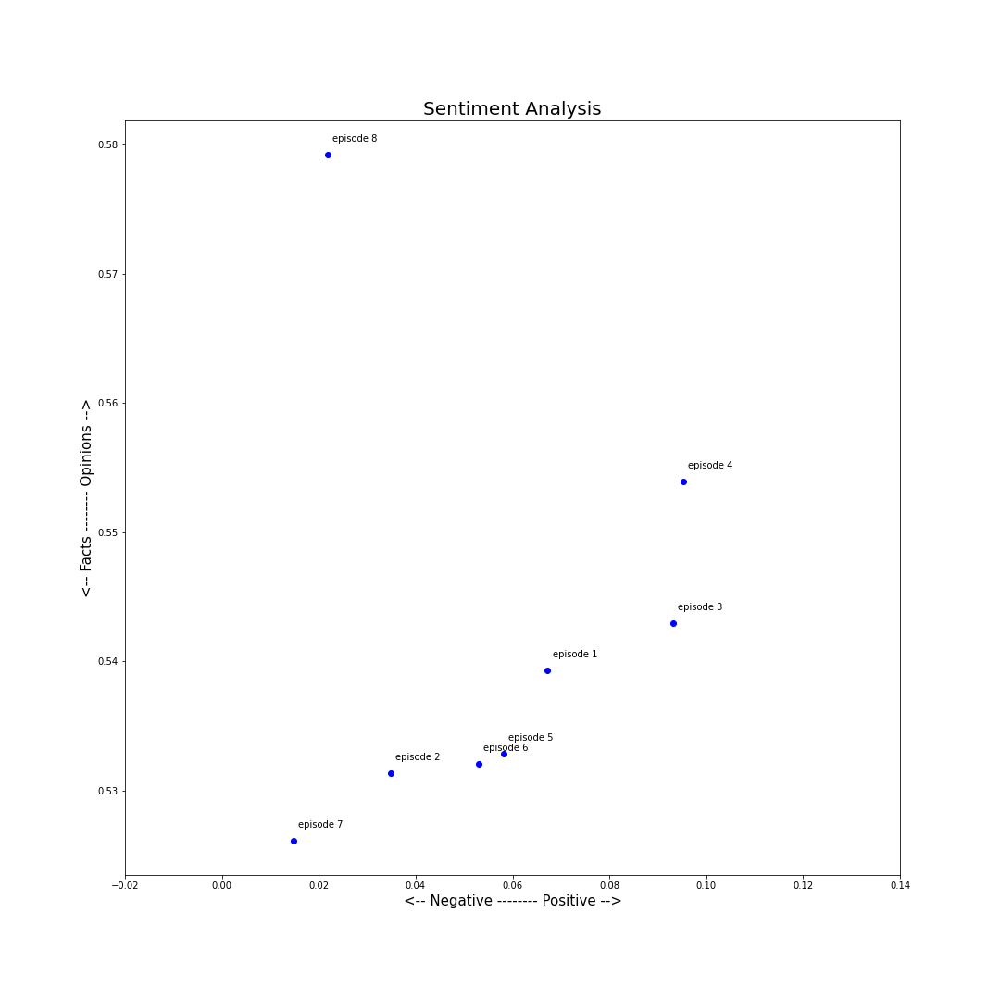
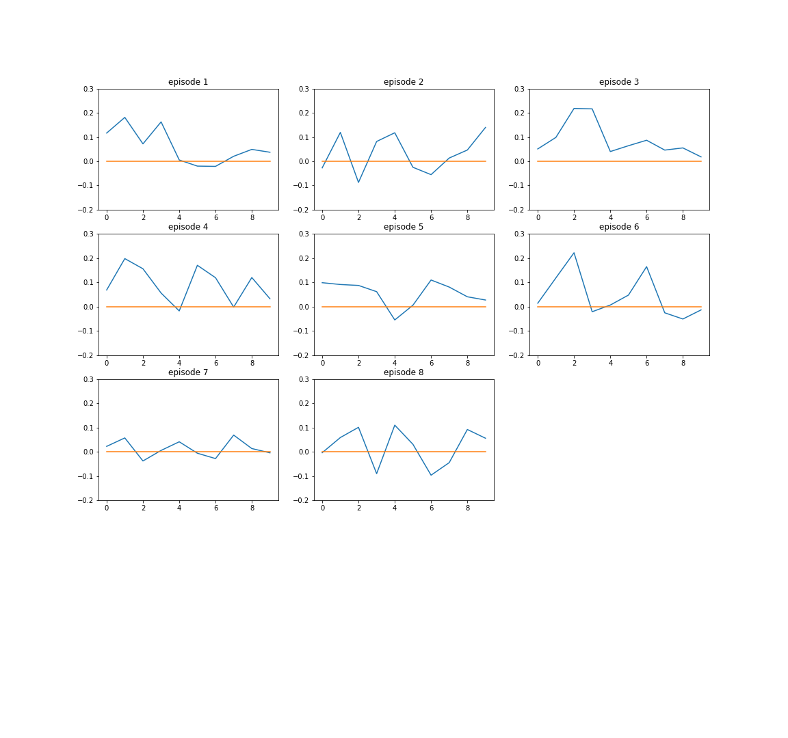

# NLP analysis of series Wednesday(available on netflix)

## episodes list (scraped from [Scraps from the loft](https://scrapsfromtheloft.com/))

1. Wednesday's Child Is Full of Woe. 
2. Woe Is the Loneliest Number. 
3. Friend or Woe. 
4. Woe What a Night. 
5. You Reap What You Woe. 
6. Quid Pro Woe. 
7. If You Don't Woe Me by Now. 
8. A Murder of Woes.

## Preprocessing scripts

1. Text into lowercase
2. Remove text in square brackets
3. Remove punctuation and remove words containing numbers
4. Remove links
5. Remove initial released on 

### Wordcloud

### Words analysis

### Sentiment analysis

### Over time

*Note: We can change this interval in the file.*

## Topic Modelling

1. Topic 0: dance
2. Topic 1: characters
3. Topic 2: gates
4. Topic 3: parents,time

- Topic 0:
   - episode 3
   - episode 4
   - episode 6
- Topic 1:
   - episode 7
- Topic 2:
   - episode 2
   - episode 5
   - episode 8
- Topic 3:
   - episode 1

### Text generation is done in `text_generation.ipynb`
